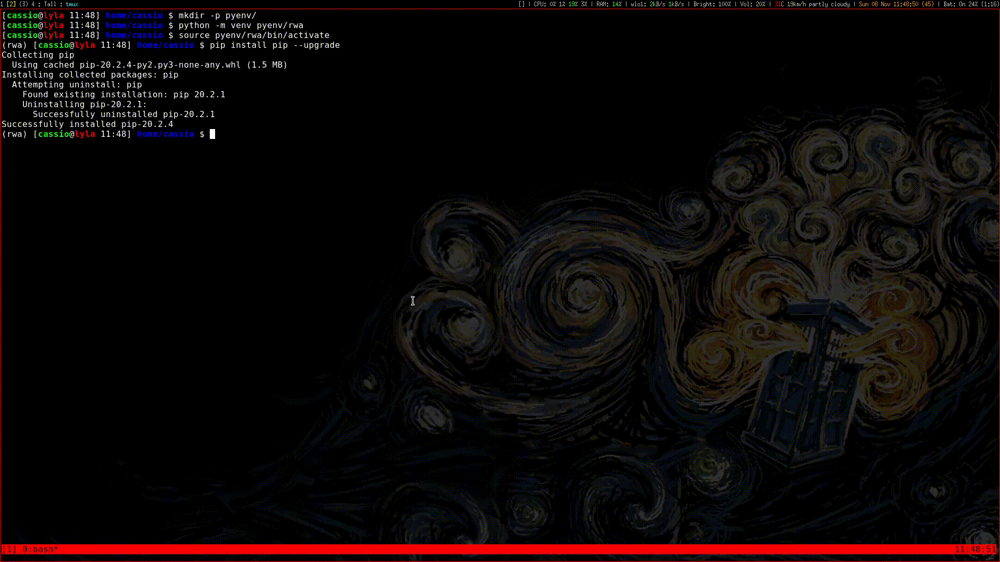

# RWA Simulator over WDM Optical Networks

This repo contains a simulator that covers the routing and
wavelength assignment (RWA) problem over wavelength-division multiplexing
(WDM)-based all-optical networks with static traffic (SLE, for static lightpath
establishment).

:pencil: Documentation: https://rwa-wdm.readthedocs.io/en/latest/index.html

The following algorithms are implemented:

- Routing     
    - Dijkstra's algorithm    
    - Yen's algorithm (also known as K-shortest path algorithm)    
- Wavelength Assignment     
    - First-fit algorithm    
    - Random-fit algorithm    
    - Vertex coloring algorithm    
- RWA as one    
   - General Objective Function    
   - Genetic algorithm (ours)    

The traffic is modelled according to exponential distrubutions of times
(namely, the time between consecutive call arrivals and the time a successfully
allocated call remains in the network occupying resources) that follow the
Poisson distribution. This model was ported from a [Matlab toolbox written by 
Przemyslaw Pawelcza](https://la.mathworks.com/matlabcentral/fileexchange/4797-wdm-network-blocking-computation-toolbox).


## Installation

Directly from PyPI via pip:

```bash
$ pip install rwa-wdm
```

Or, from source:

```bash
$ git clone htps://github.com/cassiobatista/rwa-wdm-sim.git
$ cd rwa-wdm-sim/
$ python setup.py install --skip-build
```


## Usage

As a module from CLI:

```bash
$ python -m rwa_wdm -t rnp -c 8 -r dijkstra -w first-fit -d /tmp/results -p
```



Alternatively, as a lib:

```python
from rwa_wdm import simulator
# TBD
```


## Requirements

:warning: Manual installation of required packages is necessary only if you're
debugging the source without properly installing the package via either PyPI or
`setuptools`.

We recommend the use of [Anaconda](https://www.anaconda.com/):

```bash
$ conda create --name rwa python=3.8 argcomplete networkx numpy matplotlib
$ conda activate rwa
```

However, you can of course just use pip as well:

```bash
$ pip install pip --upgrade
$ pip install argcomplete numpy matplotlib networkx
```

Or simply use the `requirements.txt` file:

```bash
$ pip install -r requirements.txt
```


## Citation

If you use this code, please cite us as one of the following: 

### [EPIA 2017](https://link.springer.com/chapter/10.1007%2F978-3-319-65340-2_35)

> Teixeira D.B.A., Batista C.T., Cardoso A.J.F., de S. Araújo J. (2017) 
> A Genetic Algorithm Approach for Static Routing and Wavelength Assignment in
> All-Optical WDM Networks. In: Oliveira E., Gama J., Vale Z., Lopes Cardoso H.
> (eds) Progress in Artificial Intelligence. EPIA 2017. Lecture Notes in
> Computer Science, vol 10423. Springer, Cham

```bibtex
@inproceedings{Teixeira17,
    author    = {Teixeira, Diego Bento A. and Batista, Cassio T. and Cardoso, Afonso Jorge F. and de S. Ara{\'u}jo, Josivaldo},
    editor    = {Oliveira, Eug{\'e}nio and Gama, Jo{\~a}o and Vale, Zita and Lopes Cardoso, Henrique},
    title     = {A Genetic Algorithm Approach for Static Routing and Wavelength Assignment in All-Optical WDM Networks},
    booktitle = {Progress in Artificial Intelligence},
    year      = {2017},
    publisher = {Springer International Publishing},
    address   = {Cham},
    pages     = {421--432},
    doi       = {10.1007/978-3-319-65340-2_35},
    isbn      = {978-3-319-65340-2}
}
```

### [IFIP LANC 2018](https://dl.acm.org/doi/10.1145/3277103.3277126)

> Cassio Batista, Diego Teixeira, Thiago Coelho, and Josivaldo Araújo. 2018. 
> Static-Traffic Routing and Wavelength Assignment in Transparent WDM Networks 
> Using Genetic Algorithm. In Proceedings of the 10th Latin America Networking 
> Conference (LANC ’18). Association for Computing Machinery, New York, NY, 
> USA, 56–63. DOI:https://doi.org/10.1145/3277103.3277126


```bibtex
@inproceedings{Batista18,
    author    = {Batista, Cassio and Teixeira, Diego and Coelho, Thiago and Ara\'{u}jo, Josivaldo},
    title     = {Static-Traffic Routing and Wavelength Assignment in Transparent WDM Networks Using Genetic Algorithm},
    booktitle = {Proceedings of the 10th Latin America Networking Conference},
    series    = {LANC '18},
    year      = {2018},
    isbn      = {978-1-4503-5922-1},
    location  = {S\~{a}o Paulo, Brazil},
    pages     = {56--63},
    numpages  = {8},
    doi       = {10.1145/3277103.3277126},
    acmid     = {3277126},
    publisher = {ACM},
    address   = {New York, NY, USA}
}
```


## License

GPL v3.0
